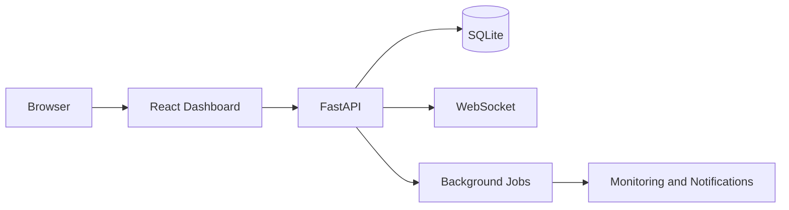

# Architecture

This note describes the portfolio snapshot. It does not describe a specific home network.

## Request path

The React dashboard is a Vite application. In development, the Vite server proxies `/api` to FastAPI. In Docker Compose, the dashboard container serves the built files and proxies the same API prefix.

Authenticated REST calls use `/api/v1`. The live channel is a WebSocket at `/api/v1/ws/dashboard`. The handler rejects a missing or invalid JWT before the client stays connected. After connect, the in-process hub broadcasts events such as agent check-in and alert changes.

FastAPI uses one SQLAlchemy engine and one SQLite file. Alembic owns the schema. There is no second database in this release.

Background work is started with the API process. Six jobs each call `run_repeated`, which runs one pass to completion and then sleeps. A pass may use a database session on a worker thread. Jobs do not call each other. They write rows that the API and the notification worker read later.

The WebSocket is served by FastAPI, and the dashboard is the client. Monitoring and notifications are the stored result of the jobs: agent offline state, infrastructure snapshots, the notification queue, photo-folder scans, and SQLite backup files.

## Jobs

| Job | Role |
|---|---|
| offline_monitor | Marks agents offline and raises alerts |
| infrastructure_monitor | Refreshes infrastructure snapshots |
| telegram_reports | Sends scheduled reports when they are due and Telegram is enabled |
| notification_worker | Delivers queued notifications |
| photo_watcher | Scans configured folders |
| sqlite_backup | Copies the SQLite database on a schedule |

Optional connectors stay idle unless configured: QNAP, Immich, QuMagie, Telegram, and Tailscale status. With `HOMELAB_INFRASTRUCTURE_MOCK=true`, the infrastructure job stores mock snapshots instead of calling those services.

## Authentication

Users sign in with a password. The API issues a JWT. Roles are admin, operator, and viewer. Agent check-in uses a separate registration key.

## Data

SQLite is the only database. New connections set a busy timeout so a locked write waits up to eight seconds. The backup job writes a gzip copy of that database to the configured backup directory. That copy is the application's own backup, not a NAS backup product.

## What this snapshot changes

Default photo folders are `/data/photos` and `library-a` through `library-e` under that directory. Docker Compose uses those generic paths. Production uses a private layout that is not in this tree.
